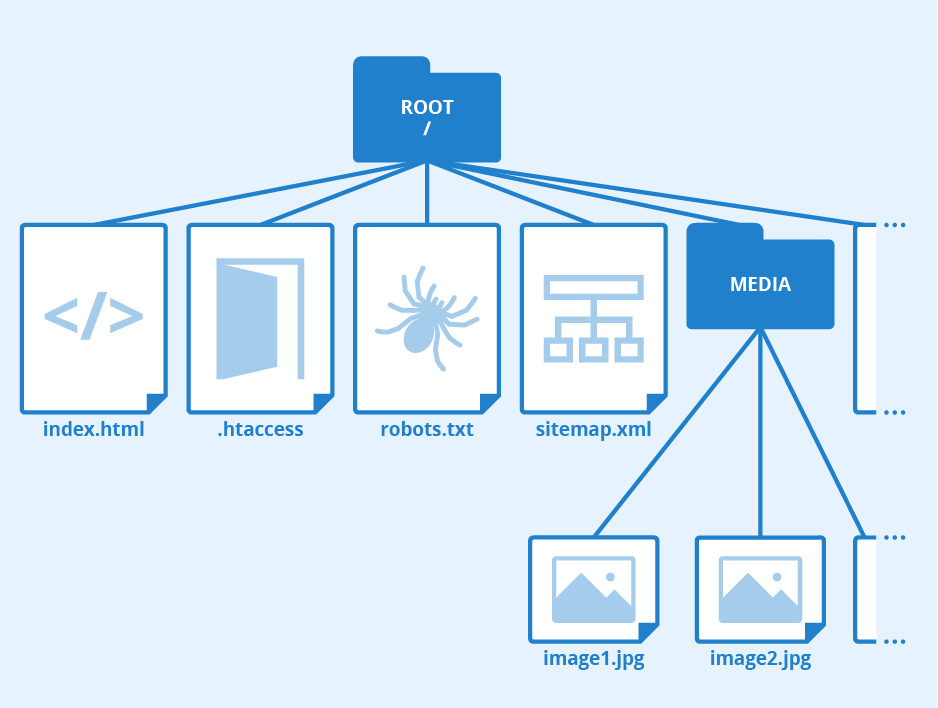

## CLI

- `GUI(Graphic User Interface)` : 그래픽을 통해 사용자와 컴퓨터가 상호작용하는 방식
- `CLI(Command Line Interface)` : 터미널을 통해 사용자와 컴퓨터가 상호작용하는 방식

## Command

- `pwd` : 현 위치 반환
- `cd ..` : 상위폴더로 이동, `cd ../..`
- `ls -al` : view list
- `mkdir` : make directory
- `touch` : make file
- `vi` : make file or modify file
  - `i` key 입력 : 파일 수정 
  - `Esc` + `:` + `wq` + `Enter` : 수정 완료
- `rm` : remove file
- `rm -r` : remove directory
- `mv` : 파일을 폴더로 이동 or 파일 이름 변경
- `code .` : vscode 열기
- `start .` : directory 열기

## 단축키

- `ctrl` + `a` : 커서 맨앞으로 이동
- `ctrl` + `e` : 커서 맨뒤로 이동
- `ctrl` + `w` : 커서 앞의 단어 삭제
- `ctrl` + `l` : clear는 아니지만 화면을 위로 올림
- `ctrl` + `insert` : copy
- `shitf` + `insert` : paste

## Git & GitHub

1. `Git` : 분산버전관리시스템 (히스토리 관리, 백업과 협업이 가능)

   분산버전관리시스템 < ------ > 중앙집중시스템

   - 누가 commit 기록을 남겼는지 확인, 최초 한 번만 설정(컴퓨터 1대)

     `git config --global user.name "name"`

     `git config --global user.email "email"`

   - 로컬저장소(git)

     - working directory : 사용자의 일반적인 작업이 일어나는 곳

     - staging area : commit을 위한 파일 및 폴더가 추가되는 곳

     - repository : staging area에 있던 파일 및 폴더의 변경사항을 저장하는 곳

       

   - command

     `git init` : 현재 작업 중인 directory를 Git으로 관리, '.git'파일 생성

     `rm -rf .git` : 'git init' 취소

     `git remote add <원격 저장소 name> <github repository address>` : 원격저장소 등록

     `git add` : working directory -> staging area

     `git status` : 'git add'가 잘 되었는지 확인

     `git commit -m "~"` : staging area -> repository, 저장소에 저장(^) 

     실제 폴더와 working directory에 존재

     `git log --all --oneline --graph` : 'git commit -m "~"'이 잘 되었는지 확인, branch 관련 그래프

     `git log -1` : 최신 버전 log 1개만 보임

     `git push -u <원격 저장소 name> <branch name>` : 원격저장소에 업로드, 이후부터 `git push`만 입력

   - repository name(GitHub) = directory name
   - `vi .gitignore`

     - '.gitignore'에 쓰는 파일들은 무시하고 원격저장소에 업로드
     - '.git'과 같은 선상에 존재
     - 반드시 'git add' 전에 작성
     - `gitignore.io` : 자신의 개발 환경에 맞는 것을 찾아 복붙

2. `GitHub` : Git 기반의 repository, 원격저장소

## git pull

- `git clone <원격 저장소 주소>` : 해당 github에 push된 파일 및 폴더 복제,

​																'git init'과 'git remote add'는 이미 수행된 상태, `.`을 추가하면 바로 복제

- `git pull <원격 저장소 name> master` : 원격저장소에서 가져오기

## branch

- 'branch' = 작업 공간

  같은 파일과 폴더로 서로 다른 작업을 하고 싶은 경우 사용

- command

  `git branch` : branch 조회 or 생성 (branch 생성 전 최소 1번 이상 commit해야 함)

  `git switch` (= git checkout) : branch 이동

  `git switch -c` : branch 생성 + 이동

  `git branch -d` : branch 삭제

  `git merge` : branch 병합, Merge 이후 commit은 `git commit`

## Except

- `git restore` : working directory 내에서 가장 최근 버전의 파일로 복구, 신중히 사용할 것

- `git restore --staged` : staging area --> working directory로 파일 이동

- `git rm --cached` : Git에 있는 파일 삭제 (untracked file)

- `git rm --cached -r` : Git 내의 모든 파일을 재귀적으로 삭제

- `git commit --amend`
  - 방금 commit한 commit message 변경
  - 바로 직전에 commit한 것과 같은 commit message로 commit
  
- `git diff` : working directory & staging area, working directory & repository 비교

- `git diff --staged` : staging area & repository 비교

- `git reset` : `<commit ID>`를 기준으로 최근 버전들을 삭제, time slip to `<commit ID>`
  
  - `git reset --hard <commit ID>` : 모두 삭제
  - `git reset --soft <commit ID>` : repository만 삭제
  - `git reset --mixed <commit ID>` : staging area와 repository 삭제
  
- `git revert $..%` : commit $ 부터 commit % 까지의 이력을 복원(commit $는 제외),

  ​								 commit message는 그대로.

## ex)

- 파일 트리에서

  

  **만약 ROOT를 git저장소로 생성하였다면(ROOT 폴더 내에 .git이 있음) MEDIA를 git저장소로 생성할 수 없음**

- Git 즉 로컬저장소에서 파일이나 폴더를 ~까지 진행하였다면 파일이나 폴더는 ~에 있다

  git commit : 실제 폴더, working directory, repository

  git add : 실제 폴더, working directory, staging area

  +) commit이 완료된 파일이나 폴더를 수정했다면 그것은 working directory에 있음

- 'git commit'의 message를 title + content로 주고자 할 때

  `git commit` --> `i` 입력 --> `title` 입력 --> `Enter` * 2 --> `content` 작성 --> `Esc` + `:` + `wq` + `Enter`